## AWS Load Balancer Controller

This module installs the AWS Load Balancer Controller in an EKS cluster and creates the
IAM policy and IAM role that the controller uses to manage AWS load balancers for
Kubernetes `Ingress`, `Service`, and Gateway-style resources.

### Minimal usage

```hcl
module "this" {
  source = "dasmeta/eks/aws//modules/aws-load-balancer-controller"
  # version = "x.y.z" # check the latest module version in Terraform Registry

  cluster_name = "example-cluster"
  region       = "eu-central-1"

  iam = {
    policy_name           = null
    policy_description    = null
    role_name             = null
    attachment_method     = "service_account_role_annotation"
    use_descriptive_names = false
  }
}
```

### What it handles

- Watches Kubernetes `Ingress` resources that use the `alb` ingress class
- Watches supported `Service` resources that need AWS load balancer integration
- Reconciles AWS ALB and NLB resources from cluster-side desired state
- Creates the IAM policy and IAM role required by the controller
- Supports IRSA annotation, built-in EKS Pod Identity association, or externally managed
  Pod Identity association

### Architecture sketch



### Identity modes

The module supports three permission-binding modes:

1. `iam.attachment_method = "service_account_role_annotation"`
   The controller service account gets the `eks.amazonaws.com/role-arn` annotation.
2. `iam.attachment_method = "pod_identity_association"`
   The module creates an EKS Pod Identity association for the controller service account.
3. `iam.attachment_method = null`
   The module still creates the IAM role and IAM policy, and you can create the Pod
   Identity association separately outside the module.

For IRSA mode, `oidc_provider_arn` is the only required OIDC input. The module derives
the issuer ID suffix used in the trust-policy condition keys from that ARN. If
`oidc_provider_arn` is not provided, the module resolves it from the EKS cluster named by
`cluster_name`.

### Chart source behavior

- Default behavior uses the upstream EKS charts repository.
- You can override both `chart.repository` and `chart.name`.
- If `chart.name` is a direct packaged-chart URL, such as a `.tgz` endpoint, it becomes
  the authoritative source and `chart.repository` is ignored.

### Future upgrade workflow

Use this procedure for future controller upgrades:

1. Find the next chart version in Artifact Hub:
   `https://artifacthub.io/packages/helm/aws/aws-load-balancer-controller`
2. Find the matching IAM policy source in the upstream tagged docs(the policy rarely being changes per new versions):
   `https://raw.githubusercontent.com/kubernetes-sigs/aws-load-balancer-controller/<tag>/docs/install/iam_policy.json`
3. Replace the local checked-in file at:
   `modules/aws-load-balancer-controller/iam-policy.json`
4. Update the default chart version in:
   `modules/aws-load-balancer-controller/variables.tf`
5. Validate any trust-policy, chart-value, or release-note changes before applying the
   upgrade.

<!-- BEGINNING OF PRE-COMMIT-TERRAFORM DOCS HOOK -->
# Creates aws load balancer controller on eks cluster

Docs and supported ingress annotations:
https://kubernetes-sigs.github.io/aws-load-balancer-controller/latest/guide/ingress/annotations/

## Requirements

| Name | Version |
|------|---------|
| <a name="requirement_terraform"></a> [terraform](#requirement\_terraform) | ~> 1.3 |
| <a name="requirement_aws"></a> [aws](#requirement\_aws) | > 5.0, < 7.0 |
| <a name="requirement_helm"></a> [helm](#requirement\_helm) | ~> 2.0 |

## Providers

| Name | Version |
|------|---------|
| <a name="provider_aws"></a> [aws](#provider\_aws) | > 5.0, < 7.0 |
| <a name="provider_helm"></a> [helm](#provider\_helm) | ~> 2.0 |

## Modules

No modules.

## Resources

| Name | Type |
|------|------|
| [aws_eks_pod_identity_association.this](https://registry.terraform.io/providers/hashicorp/aws/latest/docs/resources/eks_pod_identity_association) | resource |
| [aws_iam_policy.this](https://registry.terraform.io/providers/hashicorp/aws/latest/docs/resources/iam_policy) | resource |
| [aws_iam_role.aws-load-balancer-role](https://registry.terraform.io/providers/hashicorp/aws/latest/docs/resources/iam_role) | resource |
| [aws_iam_role_policy_attachment.AWSLoadBalancerControllerIAMPolicy](https://registry.terraform.io/providers/hashicorp/aws/latest/docs/resources/iam_role_policy_attachment) | resource |
| [helm_release.aws-load-balancer-controller](https://registry.terraform.io/providers/hashicorp/helm/latest/docs/resources/release) | resource |
| [aws_eks_cluster.this](https://registry.terraform.io/providers/hashicorp/aws/latest/docs/data-sources/eks_cluster) | data source |
| [aws_iam_openid_connect_provider.this](https://registry.terraform.io/providers/hashicorp/aws/latest/docs/data-sources/iam_openid_connect_provider) | data source |

## Inputs

| Name | Description | Type | Default | Required |
|------|-------------|------|---------|:--------:|
| <a name="input_chart"></a> [chart](#input\_chart) | Chart source settings. name can be a chart name or a direct packaged-chart URL ending with .tgz; repository is ignored for direct URLs. | <pre>object({<br/>    version    = optional(string, "3.3.0")<br/>    repository = optional(string, "https://aws.github.io/eks-charts")<br/>    name       = optional(string, "aws-load-balancer-controller")<br/>  })</pre> | `{}` | no |
| <a name="input_cluster_name"></a> [cluster\_name](#input\_cluster\_name) | eks cluster name | `string` | `""` | no |
| <a name="input_configs"></a> [configs](#input\_configs) | Configurations to pass and override default ones. Check the chart values here: https://artifacthub.io/packages/helm/aws/aws-load-balancer-controller | `any` | `{}` | no |
| <a name="input_create_namespace"></a> [create\_namespace](#input\_create\_namespace) | wether or no to create namespace | `bool` | `false` | no |
| <a name="input_enable_waf"></a> [enable\_waf](#input\_enable\_waf) | Enables WAF and WAF V2 addons for ALB | `bool` | `false` | no |
| <a name="input_iam"></a> [iam](#input\_iam) | Optional IAM naming controls. Explicit names win when set. When use\_descriptive\_names is true, names are generated as aws-load-balancer-controller-{cluster\_name} and aws-load-balancer-controller-{cluster\_name}\_iam\_role. Otherwise the legacy cluster\_name-based defaults are used. Enable by default in new-cluster use cases when possible. | <pre>object({<br/>    policy_name           = optional(string, null)                              # Optional IAM policy name override<br/>    policy_description    = optional(string, null)                              # Optional IAM policy description override<br/>    role_name             = optional(string, null)                              # Optional IAM role name override<br/>    attachment_method     = optional(string, "service_account_role_annotation") # IAM role attachment mode: service_account_role_annotation or pod_identity_association; set null to manage the association externally<br/>    use_descriptive_names = optional(bool, false)                               # When true, generate descriptive names instead of legacy cluster-based defaults<br/>  })</pre> | `{}` | no |
| <a name="input_image"></a> [image](#input\_image) | Optional controller image override. When repository/tag are null, the chart default image is used. | <pre>object({<br/>    repository = optional(string, null)<br/>    tag        = optional(string, null)<br/>  })</pre> | `{}` | no |
| <a name="input_namespace"></a> [namespace](#input\_namespace) | namespace load balancer controller should be deployed into | `string` | `"kube-system"` | no |
| <a name="input_oidc_provider_arn"></a> [oidc\_provider\_arn](#input\_oidc\_provider\_arn) | OIDC provider ARN used for the IRSA trust policy. If not provided, it is resolved from the EKS cluster identified by cluster\_name. | `string` | `null` | no |
| <a name="input_region"></a> [region](#input\_region) | AWS Region name. | `string` | n/a | yes |
| <a name="input_service_account_name"></a> [service\_account\_name](#input\_service\_account\_name) | The service account name to attach balancer deployment | `string` | `"aws-load-balancer-controller"` | no |
| <a name="input_vpc_id"></a> [vpc\_id](#input\_vpc\_id) | The AWS VPC Id where EKS deployed. Issue https://github.com/kubernetes-sigs/aws-load-balancer-controller/issues/3695 | `string` | `null` | no |

## Outputs

| Name | Description |
|------|-------------|
| <a name="output_iam_policy_arn"></a> [iam\_policy\_arn](#output\_iam\_policy\_arn) | The IAM policy ARN used by the controller role. |
| <a name="output_iam_role_arn"></a> [iam\_role\_arn](#output\_iam\_role\_arn) | The IAM role ARN used by the controller. |
| <a name="output_iam_role_name"></a> [iam\_role\_name](#output\_iam\_role\_name) | The IAM role name used by the controller. |
| <a name="output_pod_identity_association_id"></a> [pod\_identity\_association\_id](#output\_pod\_identity\_association\_id) | The EKS Pod Identity association ID when iam.attachment\_method is pod\_identity\_association. |
<!-- END OF PRE-COMMIT-TERRAFORM DOCS HOOK -->
